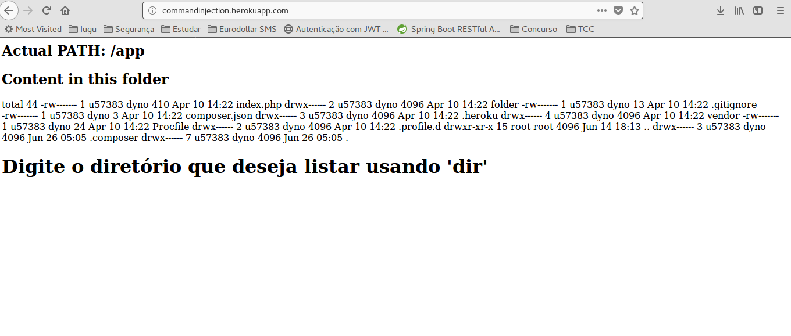
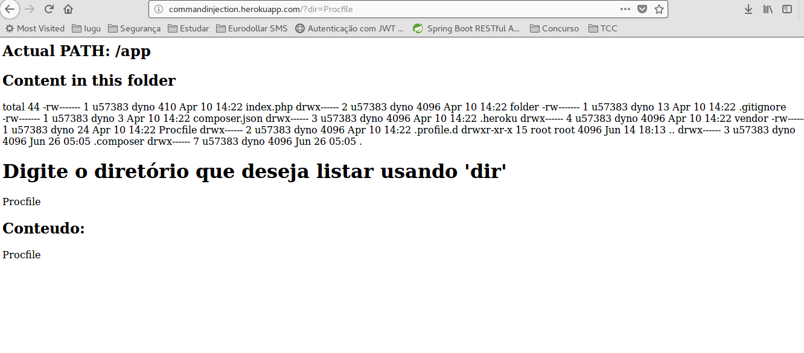
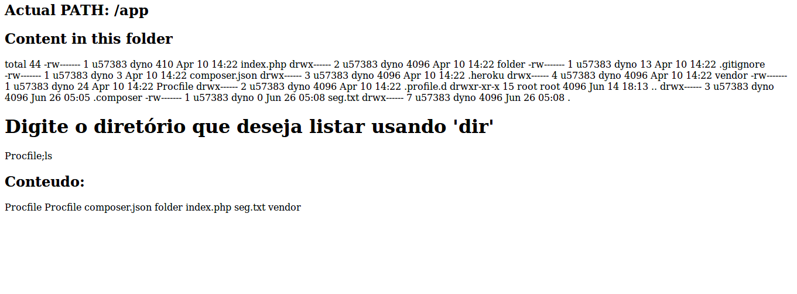
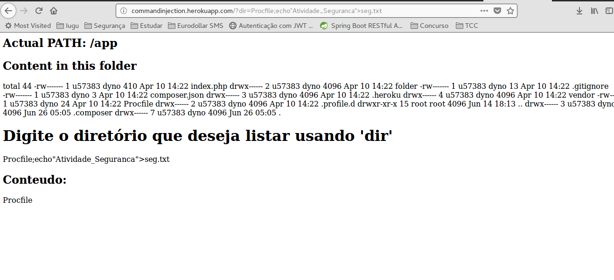

## Atividade de Comand Injection
### Atividade 1:
1. Comando de criar arquivo.

2. Arquivo criado.

3. Listado todos os diretórios e arquivo e passado o conteúdo para o arquivo.

4. Removendo arquivo.

5. Arquivo removido

### Atividade 2:
1. Página Inicial

2. Acessa Pasta Profile
 
3. Listar conteúdo
 
4. Criando arquivo
 