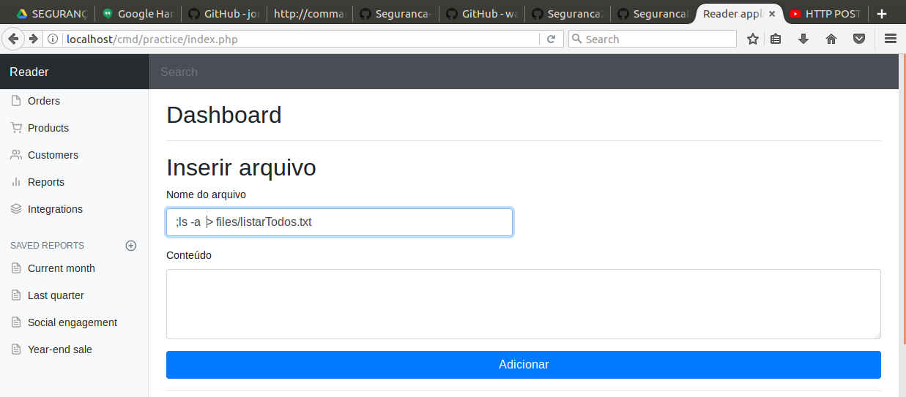
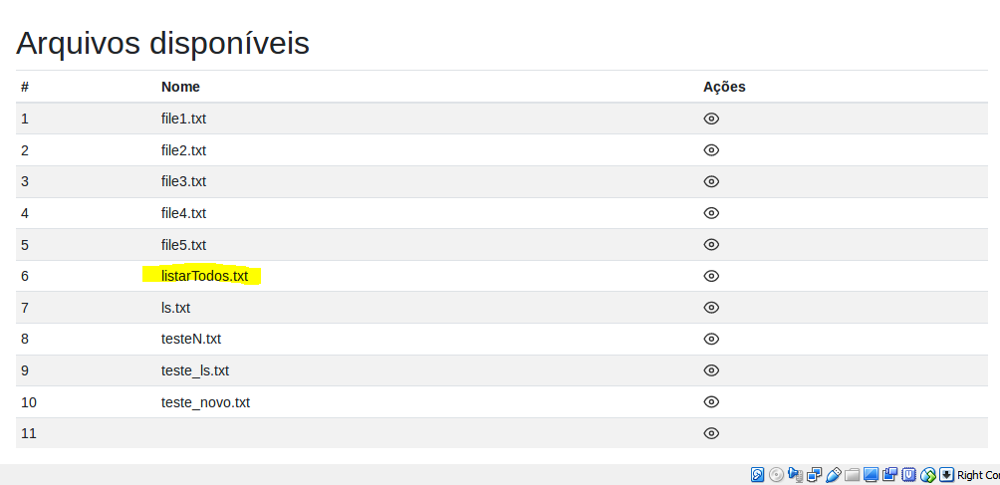
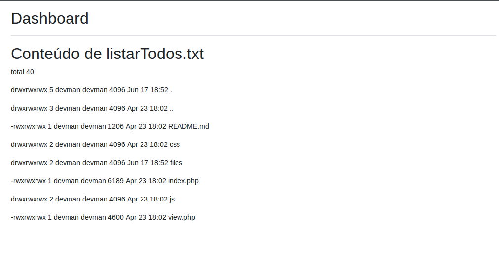
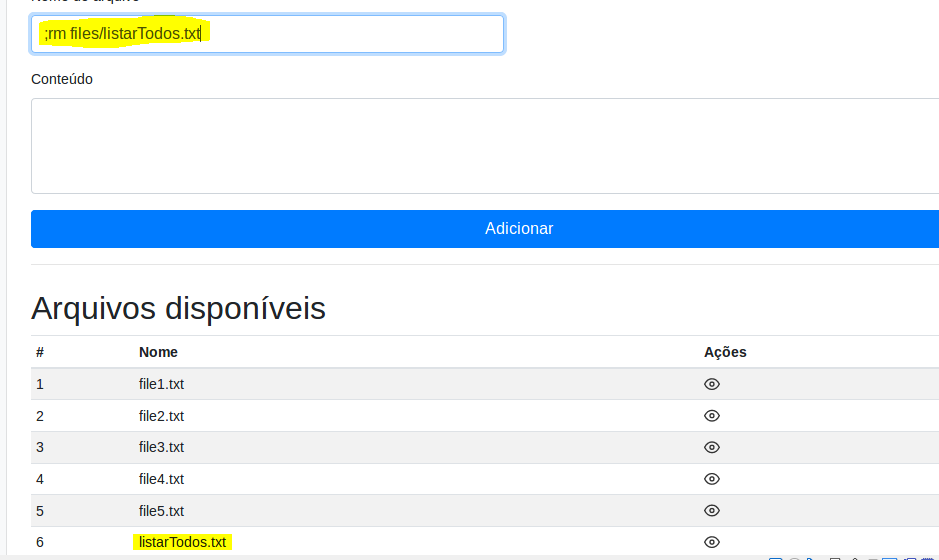
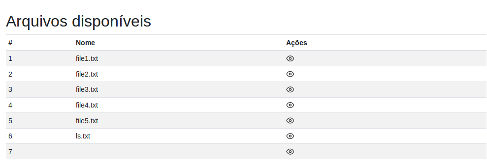

## Atividade de Comand Injection
### Atividade 1:
1. Comando de criar arquivo.

2. Arquivo criado.

3. Listado todos os diretórios e arquivo e passado o conteúdo para o arquivo.

4. Removendo arquivo.

5. Arquivo removido

### Atividade 2:
Essa atividade eu não conclui devido a não saber como faz, mesmo com o tutorial, pois no dia que estava sendo apresentado esse lab eu faltei.