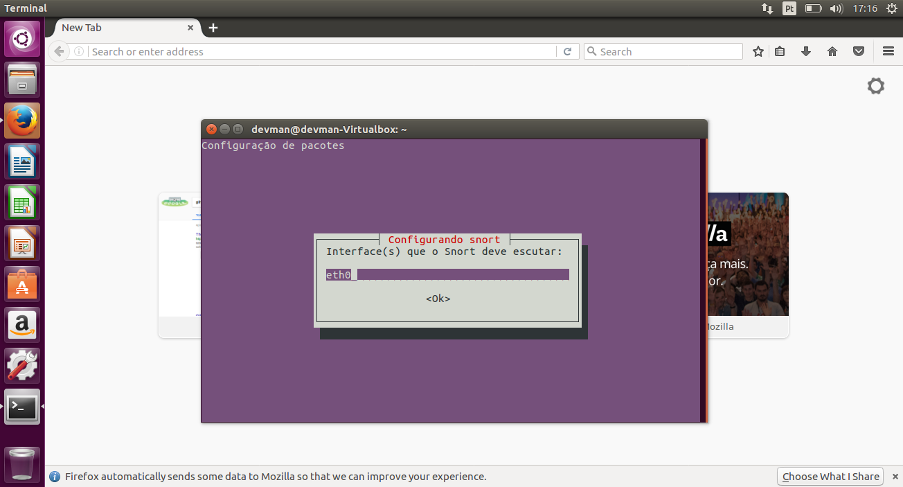
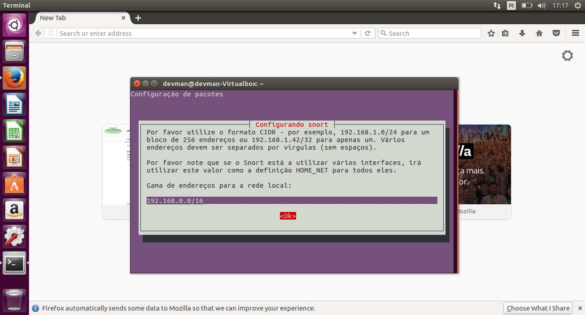
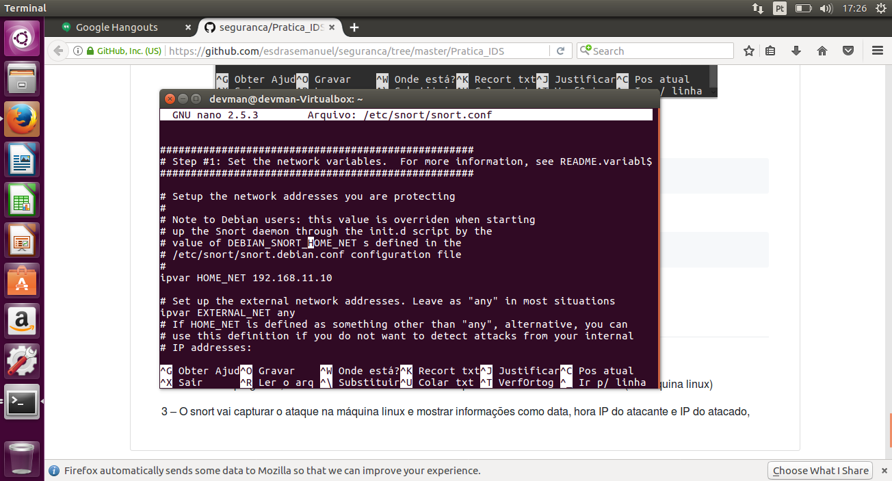
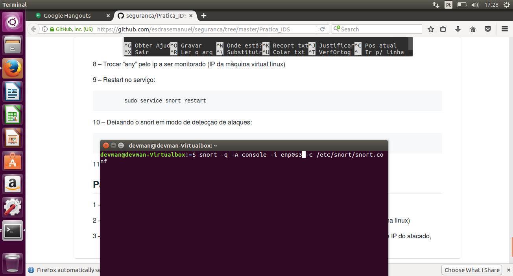
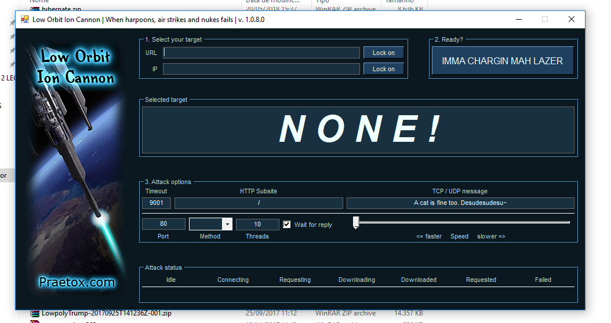
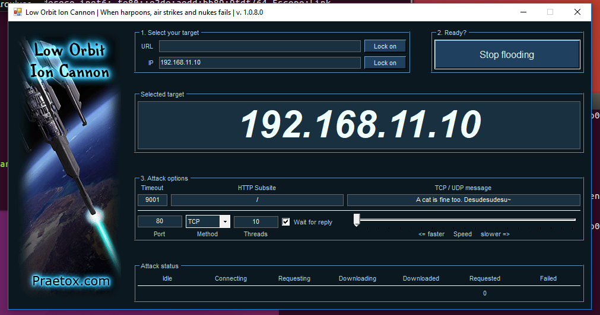
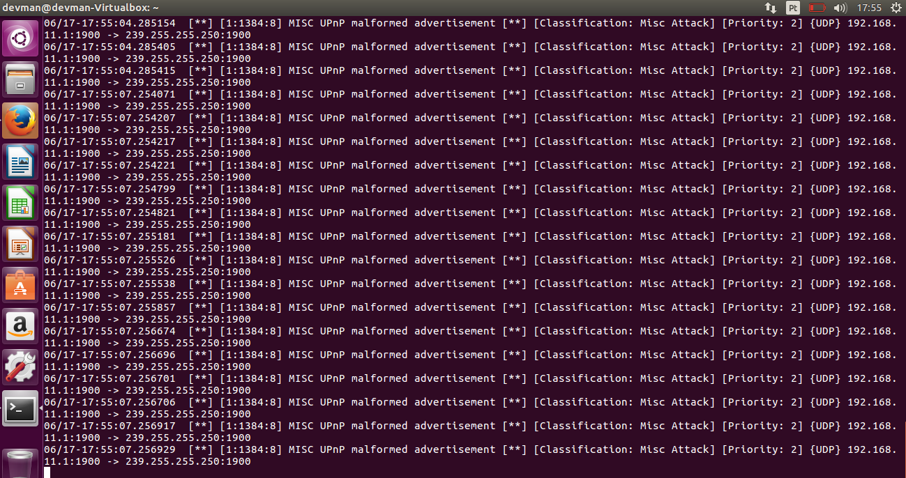

## Laboratório de IDS
1. Configurando snort

2. Configurando IP

3. Habilitando modo de escrita

4. Deixando snort modo escuta

5. Executando LOIC.

6. Selecionando Ip de ataque.

7. Monitorando ataque

