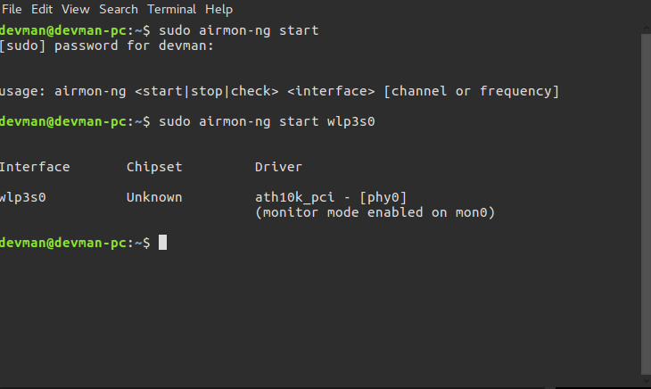
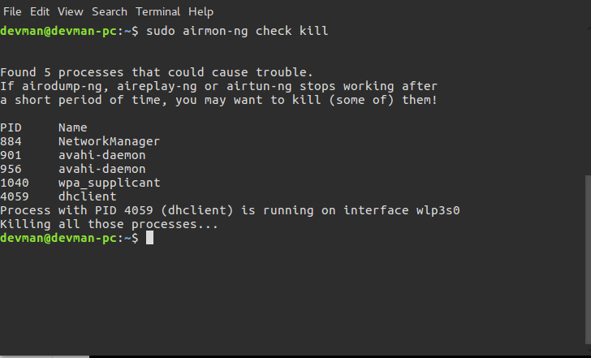
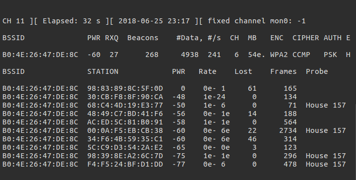
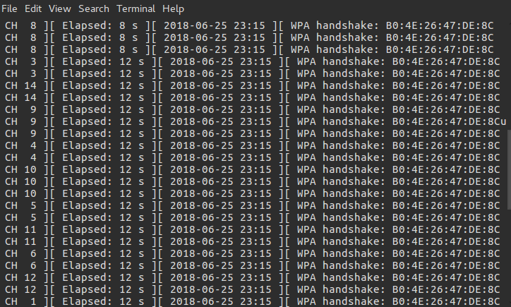
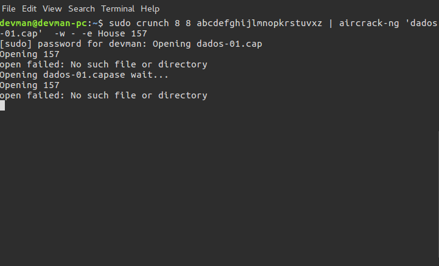

1. Verificar o nome da sua interface Wi-FI: 

2. Ubuntu está reconhecendo o driver da interface sem fio: 

3. verificar se tem algum processo que pode acabar atrapalhando o processo de captura de pacotes: 

4. Colocar nossa placa de rede em modo monitor:
 
5. Redes disponíveis para nossos possíveis ataques
 
6. WPA HANDSHAKE seja capturado.

7. Verificar o WPA HANDSHAKE

8. Tento quebrar o WIFI, porém apresenta esse erro, mas o Arquivo existe.

